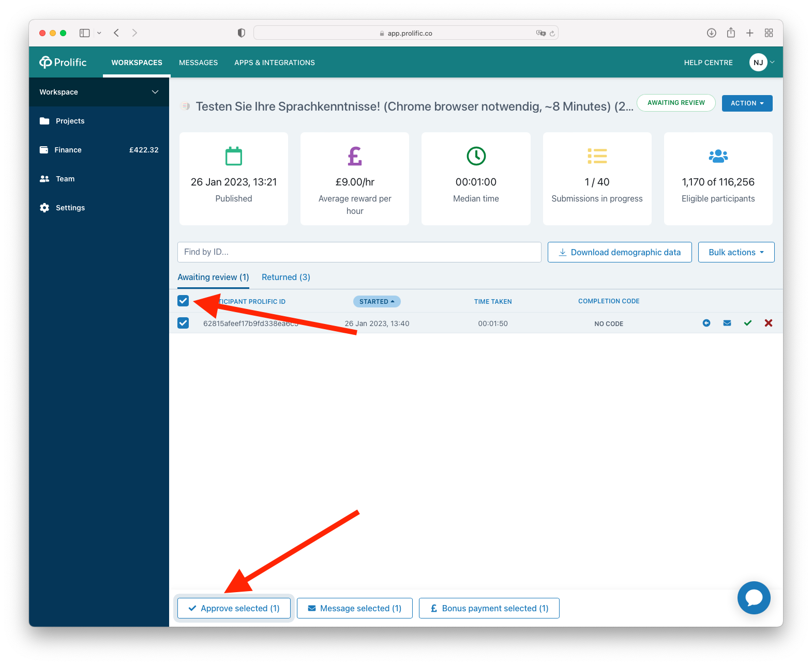

===================================
Deploying an experiment to Prolific
===================================

Prolific is a paid service for sourcing online participants for psychology experiments.
For a general introduction to Prolific, visit the `Prolific website <https://prolific.co/>`_.

PsyNet has recently (as of 2022) developed support for deploying experiments to Prolific.
The integration works well already, and we've deployed many successful experiments via this route.
However we are still finessing some aspects of the integration to improve the user experience.

Setting up your Prolific account
--------------------------------

The first step is to create a Prolific account via `Prolific website <https://prolific.co/>`_.
Before you can run experiments you will have to add funds to your account.

Setting up your computer
------------------------

In order to connect your local computer to your Prolific account you will have to download an API key
from the Prolific website. You can access this by navigating to the `Prolific website <https://prolific.co/>`_,
clicking 'Settings', then under 'Developer tools' clicking 'Go to API token page'.
Create a token here, and copy it to your clipboard.
You will put this token in a general configuration file called ``.dallingerconfig``;
information placed here is shared across all experiments that you run on your computer.
This file is located in your home directory, at ``~/.dallingerconfig``.
If the file doesn't exist already, create it; then open it with a text editor.
Enter your API key as follows:

::

    [Prolific]
    prolific_api_token = xxxxxxx

Save and close the file.

Setting experiment configuration
--------------------------------

Several aspects of the experiment configuration need setting before you deploy to Prolific.
This is done by editing ``config.txt``, or equivalently by setting values in the Experiment config dictionary,
for example:

.. code-block:: python

    class Experiment(Exp):
        config = {
            "wage_per_hour": 10,
        }

First you need to specify the config variable ``currency``, which corresponds to the currency with which
you expect to pay your participants. This is specified as a symbol, for example ``$``.
With Prolific you will ordinarily be paying in pounds (£).
If you want to pay in a different currency, you need to contact Prolific support.

Then you need to specify ``wage_per_hour``, i.e. how much you will aim to pay your participants per hour,
as expressed in your fundamental currency unit.

In practice PsyNet pays participants through a combination of base payment and bonus.
The base payment is fixed, and is ideally small.
It is set via the config parameter ``prolific_reward_cents``.
The bonus is dynamic, and increases
depending on how far the participant makes it through the experiment.
The value of this progress-related bonus is determined by multiplying the ``time_estimate``
for the part for the experiment they completed by the ``wage_per_hour`` (converting from seconds to hours as required).
The bonus may also include a portion corresponding to performance rewards.

.. warning::

    Set the Prolific base payment via the ``prolific_reward_cents`` parameter,
    not the ``base_payment`` parameter! The latter currently only applies to the
    Mechanical Turk Recruiter, due to an oversight in Dallinger. We hope to fix this soon.

PsyNet therefore pays people primarily through the bonus mechanism. This is at odds to how
Prolific is currently designed, in that Prolific assumes that the primary payment will come from the
base payment. This has implications in the way that Prolific treats the duration of experiments.
When you deploy an experiment to Prolific, you have to specify a duration of the experiment.
Prolific will compare that duration to your base payment to make sure that you are paying the participants enough.
So, when you deploy the experiment with Prolific, you need to set the duration to a small value,
corresponding to the size of your base payment.
This is done via the ``prolific_estimated_completion_minutes`` config variable.
If you don't set the duration to this small amount, then Prolific will complain that your hourly wage is too low.

A second problem comes from the fact that Prolific imposes an automatic time-out mechanism for participants
who take too long to complete your experiment. This time-out duration seems to be defined as a multiple of
``prolific_estimated_completion_minutes``. If you set your experiment duration (and hence your base payment)
too low, then participants will time out before they can finish your experiment.
It's not the end of the world if participants time out -- you can manually approve them via the
Prolific interface -- but it's a bit annoying, so it's worth avoiding.

In practice, if you are deploying a 15-minute experiment, it seems to work to set
``prolific_estimated_completion_minutes`` to 3, and then set your base payment to about 50 cents.
If you're confident in the duration of the experiment you could reduce the duration to 3 minutes or so.

Now you need to set your experiment's title, which is done via the ``title`` config parameter.
Here you should emphasize a few things:

- The participant needs a Chrome browser
- The participant needs headphones (if appropriate)
- The actual duration of the experiment
- The wage per hour

For example, you might write
"Organ chords experiment (headphones required, Chrome browser, 10-15 minutes, £10/hour payment)".

Next you set the experiment's ``description`` parameter. This provides more information about the experiment.
You should explain the payment strategy in more detail, in particular how they will be paid for the time they
take on the experiment via Prolific's bonus functionality. You should explain briefly what your payment
policy will be if the participant doesn't finish the experiment due to a technical error.

.. warning::
    Some of our participants have been seeing a phishing warning in their Chrome browser when they navigate to our experiment.
    This error can intimidate participants. However, it disappears if you take the test in an incognito browser.
    It's a good idea to mention this in the study description so they know not to worry.

You should select the Prolific recruiter by setting the config parameter ``recruiter`` to ``prolific``.
Also, for most users we recommend setting the ``auto_recruit`` parameter to ``false``, meaning that you will manually
control the recruitment of participants via the Prolific interface rather than letting PsyNet manage it for you.

In summary, your config.txt might look something like this:

::

    [Config]
    title = Organ chords experiment (headphones required, Chrome browser, 10-15 minutes, £10/hour payment)
    description = This is a music listening experiment, but no musical expertise is required to take part. You will listen to chords played on the organ, and you will be asked to rate them for pleasantness. We use a dynamic payment scheme which means you get paid in proportion to how far you make it through the experiment.

    [Prolific]
    recruiter = prolific
    auto_recruit = false
    wage_per_hour = 10
    prolific_reward_cents = 50
    prolific_estimated_completion_minutes = 3

Testing your experiment
-----------------------

It's a good idea to test your experiment thoroughly before deploying it. There are a few ways to do this:

1. Take it as a participant on your local computer by running ``bash docker/psynet debug local``;
2. Run the automated experiment tests via ``bash docker/run pytest test.py``.
3. Pilot it on your remote server by setting ``recruiter = generic`` in ``config.txt`` and then running
   ``bash docker/psynet debug ssh --app your-app-name``.

Deploying your experiment
-------------------------

When you're ready to deploy your experiment, give your config one last check, making sure that the
``prolific`` recruiter is selected.
Now you can deploy your app:

::

    psynet deploy ssh --app your-app-name

If the command runs successfully, it should print a link to your Prolific dashboard.
PsyNet will have automatically created a 'draft study' for your, populating certain elements such as the
title, description, and so on. Go through this draft study carefully and make sure that all the details are
set appropriately. You will need to set one of the dropdowns to 'Participants will be approved automatically'.

You can set particular demographic criteria via the Prolific interface at this point.
For example, you might choose to select participants from only a certain few countries.
Advanced users may instead want to control this behavior via PsyNet; see below for instructions.

At this point you can preview the study as if you were a Prolific participant. It's a good idea to do this
and check that everything looks OK.

Once you're ready, click `Publish study`. Your study will now be advertised to participants.
At this point you can manually decide how many participants you want to recruit.
It's a good idea to start with a small number in case something goes wrong.
Monitor the study by keeping an eye on the following routes:

- The experiment dashboard;
- The Prolific messages page;
- The docker-compose logs.

Once you're happy that the experiment is running well, you can increase the number of participants.
PsyNet seems to cope fine with e.g. 50 participants at a time, but this will depend a bit on the
efficiency of your own code.

.. image:: ../_static/images/prolific/increase_places_1.png
  :width: 800
  :alt: Increase places in the survey

Participants may encounter technical errors. Respond to them promptly via the Prolific website,
and tell them that you can pay them if they return their submission. You can look up a particular participant
via their Prolific ID in the experiment dashboard to see how much bonus they had accumulated so far
(look via the Participant tab). Normally you would pay the participant this amount of money via the Prolific website,
as a bonus; you may also wish to pay them the base payment, or part of the base payment.

Before you terminate your experiment, you want to make sure you deal with all the participants in the
'Awaiting review' category. Some of these participants may be people who had technical errors;
some may have just stopped the experiment early. You need to look through these cases and deal with them
appropriately. It's best to have a dialogue with the participant where possible, rather than rejecting their
submissions straightaway, which can upset people.

Once the experiment is finished, export the data with ``psynet export ssh --app your-app-name``,
then take down the experiment by running ``psynet destroy ssh --app your-app-name``.

Copying qualifications
----------------------

Sometimes you want to reuse demographic criteria across multiple studies.
To do this, you should first use the Prolific interface to specify a set of demographic criteria.
You can then export these criteria to a JSON file by doing the following.
First, list your Prolific experiments by running the following:

::

    dallinger hits --recruiter prolific

which will return the full list of completed or running studies, e.g.:

::

    $ dallinger hits --recruiter prolific
    ❯❯ Found 23 hit[s]:
    Hit ID                    Title                                        Annotation (experiment ID)                                                                                       Status           Created                 Expiration    Description
    ------------------------  -------------------------------------------  ---------------------------------------------------------------------------------------------------------------  ---------------  ----------------------  ------------  -------------
    63cd3c0de6a9e2d84d694454  Testen Sie Ihre Sprachkenntnisse! (Chrom...  Testen Sie Ihre Sprachkenntnisse! (Chrome browser notwendig, ~8 Minutes) (2b597a65-2e1d-8255-32e4-c1036719deb8)  AWAITING REVIEW  2023/1/22 01:37:17 PM
    …

To see unpublished studies, add the ``--sandbox`` flag.

Now copy the field ``HIT ID`` and run:

::

    dallinger copy-qualifications --hit_id <HIT_ID> --recruiter prolific

Optionally, you can specify a new path for the qualification, e.g.: ``--qualification_path
qualification_prolific_de.json`` for qualifications for German participants.

Finally, you need to add the qualification to your ``config.txt`` file:

::

    [Prolific]
    prolific_recruitment_config = file:prolific_config.json

If you don't have an existing experiment from which you want to copy the qualifications, you can create a draft study in
Prolific and then copy its HIT ID using the same steps as before.

