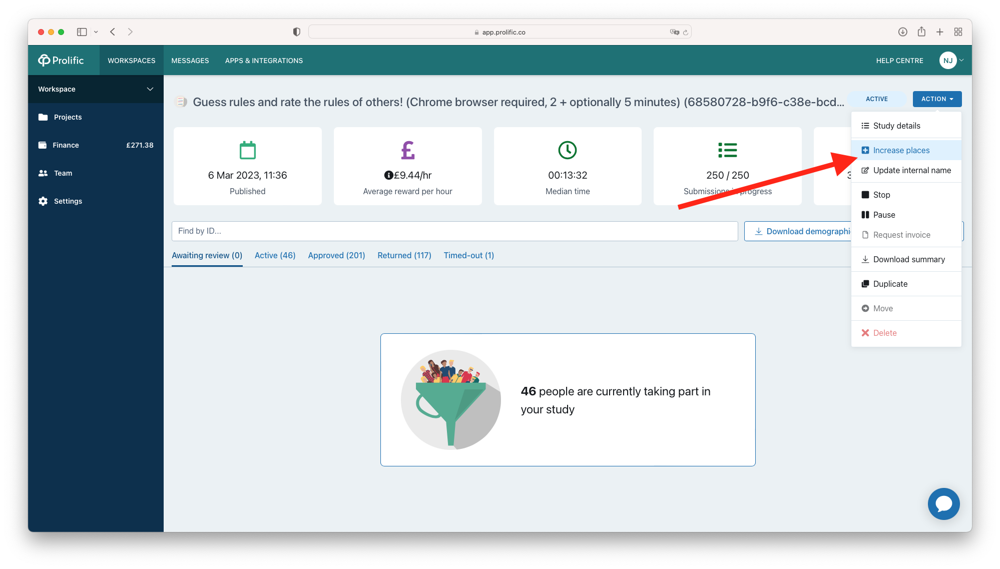

===================================
Deploying an experiment to Prolific
===================================

Prolific is a paid service for sourcing online participants for psychology experiments.
For a general introduction to Prolific, visit the `Prolific website <https://prolific.co/>`_.

Setting up your Prolific account
--------------------------------

The first step is to create a Prolific account via `Prolific website <https://prolific.co/>`_.
Before you can run experiments you will have to add funds to your account.

Setting up your computer
------------------------

In order to connect your local computer to your Prolific account you will have to download an API key
from the Prolific website. You can access this by navigating to the `Prolific website <https://prolific.co/>`_,
clicking 'Settings', then under 'Developer tools' clicking 'Go to API token page'.
Create a token here, and copy it to your clipboard.
You will put this token in a general configuration file called ``.dallingerconfig``;
information placed here is shared across all experiments that you run on your computer.
This file is located in your home directory, at ``~/.dallingerconfig``.
If the file doesn't exist already, create it; then open it with a text editor.
Enter your API key as follows:

::

    [Prolific]
    prolific_api_token = xxxxxxx

Save and close the file.

Setting experiment configuration
--------------------------------

Several configuration parameters need setting before you deploy to Prolific.
The standard way to do this is to edit ``config.txt`` in your experiment directory,
for example:

.. code-block:: text

    currency = £
    wage_per_hour = 10
    prolific_estimated_completion_minutes = 30
    base_payment = 5

The currency parameter is specified as a symbol, for example ``£``.
With Prolific you will ordinarily be paying in British pounds (£);
you may be able to access other currencies if you contact Prolific support.

The ``wage_per_hour`` parameter should be specified in terms of your above currency unit.
At the time of writing (August 2025), Prolific sets a minimum wage of £6.00/hour,
but recommends a wage of at least £9.00/hour.

The ``prolific_estimated_completion_minutes`` parameter specifies the duration of the experiment.
You can generate an estimate of the experiment's duration by running:

::

    psynet estimate

This command inspects your experiment's timeline, estimates the longest route through that timeline,
and calculates how much payment would be due at the specified ``wage_per_hour``, for example:

.. code-block:: text

    >> Estimated maximum reward for participant: £5.00
    >> Estimated time to complete experiment: 10 min 0 sec.

.. note::

    ``psynet estimate`` uses various heuristics that may not hold for all experiments.
    It is a good idea to verify the estimate by trying the experiment on yourself.
    If you notice a systematic discrepancy, you should adjust the ``time_estimate`` parameters for your pages
    until ``psynet estimate`` returns a more plausible estimate.

    It is also important to know that the 'estimated maximum reward' does not take into account
    any performance bonuses that you plan to pay out during the experiment.
    It only takes into account the estimated time taken to complete each page.

The ``base_payment`` parameter specifies the fixed payment that you will make
to participants who complete the experiment. You should normally set this to the
'maximum reward' value that ``psynet estimate`` gives you. Note that Prolific will check
that your chosen ``base_payment`` combines with your ``prolific_estimated_completion_minutes``
to yield an appropriate hourly wage.

When a participant reaches the end of the experiment, PsyNet will examine how much financial reward
they actually accumulated during the experiment, looking both at pages' time estimates and at
performance bonuses (if relevant).
It then compares this financial reward to the ``base_payment`` parameter.

Three scenarios are possible:

1. The actual reward is exactly equal to the ``base_payment`` parameter.
   In this case, PsyNet will tell Prolific that the participant should be approved.
   Prolific will then pay the participant the ``base_payment``.
2. The actual reward is greater than the ``base_payment`` parameter.
   PsyNet will then approve the participant (automatically delivering the base payment)
   and additionally then use Prolific's bonus functionality to pay the remaining amount.
3. The actual reward is less than the ``base_payment`` parameter.
   PsyNet will then not approve the participant, but will instead try to give them a partial payment.
   PsyNet's default behavior is to tell the participant that they will receive a partial payment,
   but the participant needs to return the submission to receive the payment.
   When the participant declares they have done this, PsyNet checks with Prolific via their API
   to see if the submission has actually been returned. If so, PsyNet pays the participant;
   if not, PsyNet asks the participant to wait and try again.

This flexibility in payment amounts is particularly useful for experiments that include pre-screening tasks,
or that deliver variable numbers of trials.
Note however that Prolific is a bit sensitive to people abusing this functionality;
you should avoid having too many participants receive partial payments.

Now you need to set your experiment's title, which is done via the ``title`` config parameter.
Here you should emphasize a few things:

- The participant needs a Chrome browser
- The participant needs headphones (if appropriate)

For example, you might write
"Organ chords experiment (headphones required, Chrome browser)".

Next you set the experiment's ``description`` parameter. This provides more information about the experiment.
You should explain briefly what your payment policy will be if the participant doesn't finish the experiment,
e.g. due to a technical error or a failed pre-screening task.

.. warning::
    If you do not use your own domain name (via the ``--dns-host`` argument), then Dallinger automatically
    uses a ``nip.io`` subdomain. We think this may be causing certain participants to encounter phishing warnings.
    It seems that this error can be avoided by instructing the participant to take the test in an incognito browser.

You should select the Prolific recruiter by setting the config parameter ``recruiter`` to ``prolific``.
Also, for most users we recommend setting the ``auto_recruit`` parameter to ``false``, meaning that you will manually
control the recruitment of participants via the Prolific interface rather than letting PsyNet manage it for you.

In summary, your config.txt might look something like this:

::

    [Config]
    title = Organ chords experiment (headphones required, Chrome browser, 30 minutes, £10/hour payment)
    description = This is a music listening experiment, but no musical expertise is required to take part. You will listen to chords played on the organ, and you will be asked to rate them for pleasantness. We use a dynamic payment scheme which means you get paid in proportion to how far you make it through the experiment.

    [Prolific]
    recruiter = prolific
    auto_recruit = false
    wage_per_hour = 10
    base_payment = 5
    prolific_estimated_completion_minutes = 30

Testing your experiment
-----------------------

It's a good idea to test your experiment thoroughly before deploying it. There are a few ways to do this:

1. Take it as a participant on your local computer by running ``bash docker/psynet debug local``;
2. Run the automated experiment tests via ``bash docker/run pytest test.py``.
3. Pilot it on your remote server by setting ``recruiter = generic`` in ``config.txt`` and then running
   ``bash docker/psynet debug ssh --app your-app-name``.

.. warning::

    If you are running automated experiment tests via Docker as instructed above,
    and you are using an Apple Silicon Mac, then make sure you have selected
    'Use Rosetta for x86/amd64 emulation on Apple Silicon' under the Docker preferences,
    otherwise the tests will run very slowly.

Deploying your experiment
-------------------------

When you're ready to deploy your experiment, give your config one last check, making sure that the
``prolific`` recruiter is selected.
If you need to be connected to a VPN in order to access your server, make sure you are connected to the VPN.

Now you can deploy your app.
If you do not have a domain name, then PsyNet will automatically use a ``nip.io`` subdomain.

::

    psynet deploy ssh --app your-app-name

If you do have a domain name, you should specify it via the ``--dns-host`` argument.
For example, Cambridge users might use:

::

    psynet deploy ssh --app your-app-name --dns-host musix.mus.cam.ac.uk

.. note::

    Replace ``your-app-name`` with a name of your choice.
    This name will become part of the URL that participants will visit to take part in your experiment,
    so make sure it doesn't include any funny characters or spaces.
    If your server is limited to a specific set of subdomains, your app name will be restricted to one of those subdomains.
    For example, in Cambridge we use ``psynet-01``, ``psynet-02``, etc. as app names, which then resolve to URLs of the form
    ``psynet-01.musix.cam.ac.uk``, ``psynet-02.musix.cam.ac.uk``, etc.

If the command runs successfully, it should print a link to your Prolific dashboard.
PsyNet will have automatically created a 'draft study' for your, populating certain elements such as the
title, description, and so on. Go through this draft study carefully and make sure that all the details are
set appropriately.

.. note::

    The configuration parameter ``publish_experiment`` (default = ``false``) determines whether ``psynet deploy``
    automatically publishes the experiment rather than just leaving it as a draft.
    Consider adding ``publish_experiment = true`` to your ``config.txt`` if you are deploying many similar experiments in a row,
    but note that you won't get a chance to make changes to the study configuration via the Prolific interface
    before participants arrive.

There is one item that is labeled something like 'Process submissions',
where the options are 'Manually review' and 'Approve and pay'.
Currently we think the best thing is to select 'Approve and pay' but this might change in the future.

Another item asks you how many participants you wish to recruit. This corresponds to the
``initial_recruitment_size`` parameter in the ``config.txt`` file.
Even if you plan to recruit a large number of participants, e.g. 100, it's normally best to start with a small number,
and only increase the number of participants once you're sure that everything is working well.
We've found in the past that if you give too small a number, however, Prolific deprioritizes your study,
and recruitment is slow. We recommend starting with something like 10 participants.

You can set particular demographic criteria via the Prolific interface at this point.
For example, you might choose to select participants from only a certain few countries.
Advanced users may instead want to control this behavior via PsyNet; see below for instructions.

There is also an option to set a limit on the number of participants that can take the experiment at the same time.
In theory this would be a great idea for protecting your server from excessive loads.
However, I have found in practice that recruitment seems strangely slow (or even non-existent) when this is set.
I would recommend skipping this option for now.

At this point you can preview the study as if you were a Prolific participant. It's a good idea to do this
and check that everything looks OK.

Once you're ready, click `Publish study`. Your study will now be advertised to participants.
At this point you can manually decide how many participants you want to recruit.
It's a good idea to start with a small number in case something goes wrong.
Monitor the study by keeping an eye on the following routes:

- The experiment dashboard;
- The Prolific messages page;
- The Dozzle logs.

Once you're happy that the experiment is running well, you can increase the number of participants.
PsyNet seems to cope fine with e.g. 50 participants at a time, but this will depend a bit on the
efficiency of your own code.

Participants may encounter technical errors. Respond to them promptly via the Prolific website,
and tell them that you can pay them if they return their submission. You can look up a particular participant
via their Prolific ID in the experiment dashboard to see how much bonus they had accumulated so far
(look via the Participant tab). Normally you would pay the participant this amount of money via the Prolific website,
as a bonus; you may also wish to pay them the base payment, or part of the base payment.

Before you terminate your experiment, you want to make sure you deal with all the participants in the
'Awaiting review' category. Some of these participants may be people who had technical errors;
some may have just stopped the experiment early. You need to look through these cases and deal with them
appropriately. It's best to have a dialogue with the participant where possible, rather than rejecting their
submissions straightaway, which can upset people.

.. image:: ../_static/images/prolific/awaiting_review_2.png
  :width: 800
  :alt: Pay participants who are awaiting review

Once the experiment is finished, export the data with ``psynet export ssh --app your-app-name``,
then take down the experiment by running ``psynet destroy ssh --app your-app-name``.

Copying qualifications
----------------------

Sometimes you want to reuse demographic criteria across multiple studies.
To do this, you should first use the Prolific interface to specify a set of demographic criteria.
You can then export these criteria to a JSON file by doing the following.
First, list your Prolific experiments by running the following:

::

    dallinger hits --recruiter prolific

which will return the full list of completed or running studies, e.g.:

::

    $ dallinger hits --recruiter prolific
    ❯❯ Found 23 hit[s]:
    Hit ID                    Title                                        Annotation (experiment ID)                                                                                       Status           Created                 Expiration    Description
    ------------------------  -------------------------------------------  ---------------------------------------------------------------------------------------------------------------  ---------------  ----------------------  ------------  -------------
    63cd3c0de6a9e2d84d694454  Testen Sie Ihre Sprachkenntnisse! (Chrom...  Testen Sie Ihre Sprachkenntnisse! (Chrome browser notwendig, ~8 Minutes) (2b597a65-2e1d-8255-32e4-c1036719deb8)  AWAITING REVIEW  2023/1/22 01:37:17 PM
    …

To see unpublished studies, add the ``--sandbox`` flag.

Now copy the field ``HIT ID`` and run:

::

    dallinger copy-qualifications --hit_id <HIT_ID> --recruiter prolific

Optionally, you can specify a new path for the qualification, e.g.: ``--qualification_path
qualification_prolific_de.json`` for qualifications for German participants.

Finally, you need to add the qualification to your ``config.txt`` file:

::

    [Prolific]
    prolific_recruitment_config = file:prolific_config.json

If you don't have an existing experiment from which you want to copy the qualifications, you can create a draft study in
Prolific and then copy its HIT ID using the same steps as before.
