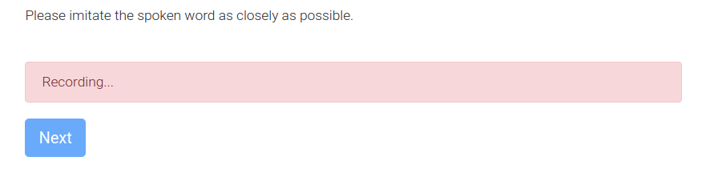
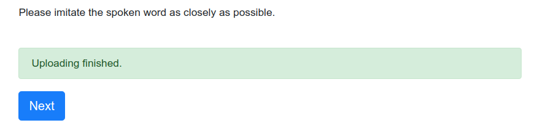

.. _modular_page:

=============
Modular Pages
=============

Modular pages are a new way to implement pages in PsyNet.
They work by splitting page design into two main components:
the `Prompts`_, constituting the information or stimulus that is presented
to the listener, and the `Controls`_, constituting the participant's
way of responding to the information or stimulus.

.. note::
  The modular page functionality is still experimental, and its API is liable to change.

Prompts
-------

The following subclasses of :class:`~psynet.modular_page.Prompt` exist:

* :class:`~psynet.modular_page.AudioPrompt`

* :class:`~psynet.modular_page.ImagePrompt`

* :class:`~psynet.modular_page.ColourPrompt`

Controls
--------

A wide range of controls all of which inherit from :class:`~psynet.modular_page.Control` are available:

Audio/Video controls
~~~~~~~~~~~~~~~~~~~~

* :class:`~psynet.modular_page.AudioMeterControl`

* :class:`~psynet.modular_page.AudioRecordControl`

* :class:`~psynet.modular_page.TappingAudioMeterControl`

* :class:`~psynet.modular_page.VideoSliderControl`

Option controls
~~~~~~~~~~~~~~~

These classes inherit from :class:`~psynet.modular_page.OptionControl`.

* :class:`~psynet.modular_page.CheckboxControl`

* :class:`~psynet.modular_page.DropdownControl`

* :class:`~psynet.modular_page.PushButtonControl`

* :class:`~psynet.modular_page.RadioButtonControl`

Other controls
~~~~~~~~~~~~~~

* :class:`~psynet.modular_page.NullControl`

* :class:`~psynet.modular_page.SliderControl`

* :class:`~psynet.modular_page.TextControl`

API
---

.. automodule:: psynet.modular_page
    :show-inheritance:
    :members:
