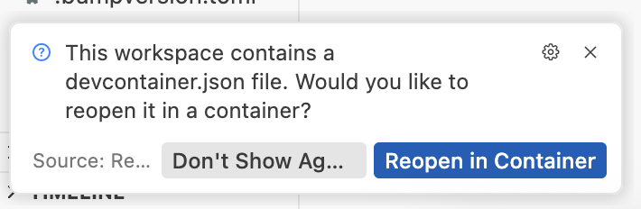
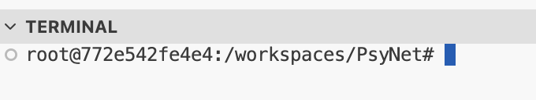
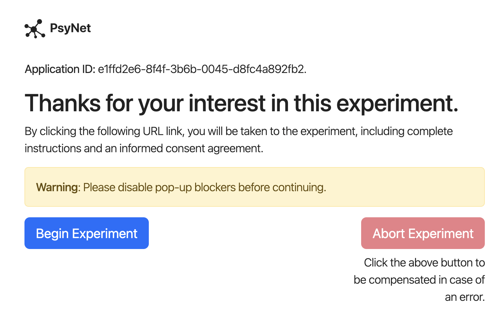
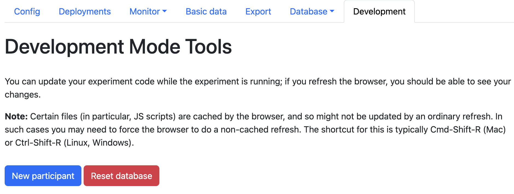

.. _running_locally:

Running PsyNet locally
======================

PsyNet relies on many interconnected services, including PostgreSQL, Redis, and Flask.
To simplify the installation process, we use Dev Containers to automatically provision
these services on your local machine.

This process works smoothly on MacOS and Linux, but it's more awkward on Windows.
We are still trying to document the different setup steps that might be necessary here.

.. note::

    If you have troubles with the below, you may wish to refer to :ref:`alternative_installation`.
    The virtual environment method described there is a more traditional way of installing PsyNet;
    it includes a few more steps, but ultimately gives you a lot of control.

Install Google Chrome
---------------------

PsyNet currently only supports Google Chrome.
You can download Google Chrome for free from the following link: https://www.google.com/chrome/.

Install Docker Desktop
----------------------

Docker is a virtualization platform used for running software in a platform-independent way.
It's required for running Dev Containers.

.. include:: ../installation/legacy_installation/docker_installation/docker_desktop_installation.rst

Install an IDE
--------------

We recommend using Visual Studio Code (VSCode) as your IDE for working with PsyNet.
This means that you can use our provided configuration files to automatically configure your IDE,
to work with PsyNet.
You can download VSCode for free from the following link: https://code.visualstudio.com/.

You might also consider using Cursor, which is an AI-enhanced fork of VSCode.
Cursor is very helpful at explaining how to use PsyNet features.
You can download Cursor for free from the following link: https://www.cursor.com/.

Download PsyNet and open it in your IDE
---------------------------------------

.. tab:: MacOS/Linux

    If you have Git installed, you can clone the PsyNet repository to your current directory
    with the following command:

    .. code-block:: bash

        git clone https://gitlab.com/PsyNetDev/PsyNet

    Alternatively, if you don't have Git installed, you can navigate to PsyNet's GitLab page,
    click the 'Code' button, and select 'Download ZIP'.
    Once the ZIP file has downloaded, unzip it to your desired location.

    Now open the repository in your IDE ('File' > 'Open Folder' in VSCode/Cursor).

.. tab:: Windows

    Running Dev Containers on Windows is a bit more complicated than on MacOS/Linux,
    because you need to use the Windows Subsystem for Linux (WSL) to run the Dev Containers.
    WSL is a Linux environment that is embedded in Windows.

    The important thing to know about using WSL is that it maintains its own filesystem,
    separate from the Windows filesystem. Instead of paths like ``C:\Users\user\PsyNet``,
    you should expect to see paths like ``/home/user/PsyNet``.
    It is possible to access Windows directories within WSL, with paths such as
    ``/mnt/c/Users/user/PsyNet``. However, accessing these directories is slow,
    so you don't want to put all your project files there. Instead, you want to make sure that
    your project files are located outside the ``mnt`` directory, for example ``/home/user/PsyNet``.
    The following instructions will help you do this.

    An easy way to work within WSL is to use the Anysphere WSL extension for VSCode/Cursor.
    You use the extension to open a WSL project window, and then for all intents and purposes,
    you are working within that Linux environment.
    Where possible, you should edit your PsyNet files within that project window.
    To install the extension, click View > Extensions and then search for 'Anysphere WSL'.

    Now open the command palette (Ctrl+Shift+P in VSCode/Cursor) and type 'WSL: Connect to WSL'.

    Your window should display 'No folder opened'. Click the 'Clone Repository' button.
    Paste in the PsyNet repository URL (https://gitlab.com/PsyNetDev/PsyNet) and click 'Clone from URL'.
    Accept the default destination. When prompted, open the repository.

    .. warning::

        This process of cloning the repository within WSL is essential.
        If you were to just clone it onto the Windows filesystem, without opening WSL first,
        it would end up in ``/mnt`` and PsyNet would run prohibitively slowly.

    Once you've done this, double-check that the Docker WSL integration is set properly.
    In Docker Desktop settings,
    go to Resources > WSL integration and make sure all the distributions are enabled.

    Now, you should double-check that your WSL version is up-to-date. Type the following into your Windows terminal:

    .. code-block:: bash

        wsl --update

    Finally, restart your computer, reopen Docker Desktop, and reopen your IDE
    to the original WSL project window (it should be called something like '~/PsyNet [WSL: Ubuntu-22.04]').
    To verify that the Docker WSL integration is working properly, open a terminal in your WSL project window
    (View > Terminal) and type the following command:

    .. code-block:: bash

        docker ps

    If you see an error message, your Docker WSL integration needs further troubleshooting, sorry...

Launch a Dev Container
----------------------

You should now see a prompt to launch a Dev Container.

Accept the prompt to launch the Dev Container.

.. note::

    Docker Desktop will need to be running for the Dev Container to start.

Before proceeding to the next step, wait until the automatic configuration scripts have stopped running
(it should take 1-2 minutes).

.. note::

    Don't worry if you see messages like this:

    .. code-block:: text

        failed to start containers: postgres
        Unable to find image 'postgres:12' locally
        12: Pulling from library/postgres

    This is not an error, it just means that the Postgres image needs to be downloaded.

.. note::

    Dev Containers are configured via a ``.devcontainer`` directory in the root of the repository.
    Together with ``Dockerfile``, this defines the environment in which the experiment will run.
    When the container is built, various installation scripts are run, including installing the Python
    packages specified in ``requirements.txt`` and ``constraints.txt``.

    There are two important things to be aware of when using Dev Containers.
    The first is that the container has its own file system, which is by default separated from your local machine.
    However, certain directories are 'mounted' from your local machine, which means they are shared between
    the container and your local machine:

    - The source code directory, which could be the PsyNet repository or a demo repository
    - ``~/.dallingerconfig`` and ``~/.dallinger``: Dallinger configuration files
    - ``~/.ssh``: SSH keys
    - ``~/psynet-data``: PsyNet data (e.g. exported data, assets)

    If you need to mount additional directories, you can do so by adding them to the ``mounts`` array in ``devcontainer.json``.

    The second important thing to be aware of is that, if you make changes to the installation process
    (e.g. by editing ``requirements.txt``), you will need to rebuild the container (CMD+Shift+P > Rebuild Container)
    for the changes to take effect.

Launch a PsyNet demo
--------------------

Once the Dev Container is running, open a terminal window.
In VSCode/Cursor, you can do this by clicking the 'Terminal' button:

You should see a terminal prompt like this:

Now navigate to a PsyNet demo.
You can see the available demos in the file explorer by navigating to the 'demos' directory.
The following code navigates to the 'timeline' demo:

.. code-block:: bash

    cd demos/timeline

Now you can launch the demo using the following command:

.. code-block:: bash

    psynet debug local

You will need to wait 10 seconds or so for the demo to start.
You may see one or more pop-ups asking whether you want to open an external website;
you should say Yes to these.

If everything works properly, you should see two web pages.
One is a participant interface, looking something like this:

The other is an admin interface, looking something like this:

You can now interact with the demo as if you were a participant.
If you want to start a second participant session, you can do this via the admin interface,
clicking the 'New participant' button on the 'Development' tab.

You can also use the admin interface to view the data collected from the participants.
Try taking a few pages of the experiment, then refresh the admin interface,
then click 'Database', and explore the available data types.
