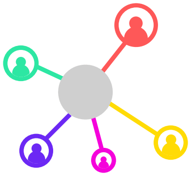

|psynet_logo| PsyNet
====================

PsyNet is a new platform for running advanced behavioral experiments
ranging from adaptive psychophysics to simulated cultural evolution.
It builds on the virtual lab framework `Dallinger <https://dallinger.readthedocs.io/en/latest/>`_.
Its goal is to enable researchers to implement and deploy experiments as efficiently as possible,
while placing minimal constraints on the complexity of the experiment design.

.. toctree::
   :maxdepth: 3
   :caption: Contents
   :titlesonly:
   :includehidden:

   introduction/index
   getting_started/index
   learning/index
   dependencies/index
   installation/index
   lab_deployments/index
   experiment_development/index
   deploy/index
   developer/index
   dashboards/translation
