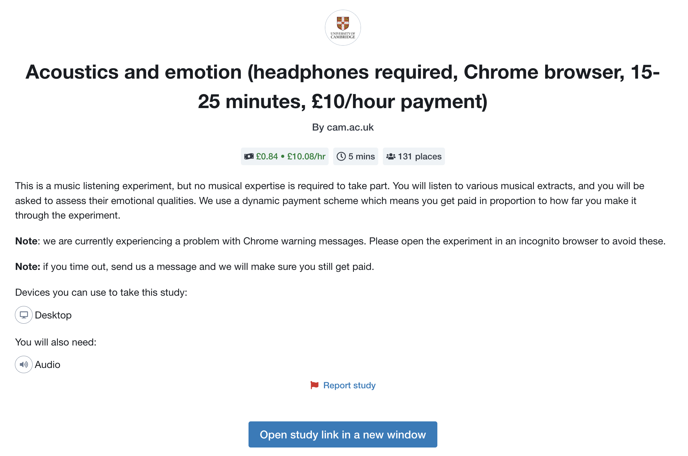

.. _AdPage:

===========
The ad page
===========

The way that the experiment is advertised to participants depends on the recruitment method.

Generic recruiter
-----------------

The 'generic' recruiter is used for experiments that are not integrated with a crowdsourcing provider.
In such cases, participants simply navigate to the experiment via a pre-specified link.
In this case PsyNet does not display an ad to the participant.

Prolific
--------

Prolific participants see an ad in their Prolific interface. This ad looks something like this:

The content of this ad is initially populated by PsyNet with reference to your experiment config,
in particular fields like ``title``, ``config``, ``wage_per_hour``, and so on.
You can customize the content via the Prolific interface.

Lab recruiter
-------------

With Lab Recruiter the ad page is hosted by PsyNet itself. The default page
shows a short introduction and a **Begin Experiment** button. It deliberately
does not derive requirements or payment promises from experiment settings;
authors should put study-specific eligibility and compensation details on
their recruitment page and consent form.

To customize PsyNet's page, add ``templates/ad.html`` to the experiment. Start
by copying PsyNet's ``psynet/templates/ad.html`` and edit its ``ad`` block;
an experiment template with that name replaces the packaged template.

The removed ``Experiment.ad_requirements`` and
``Experiment.ad_payment_information`` properties are not rendered. PsyNet
raises an error when an experiment still overrides either property, so stale
customizations do not fail silently.
