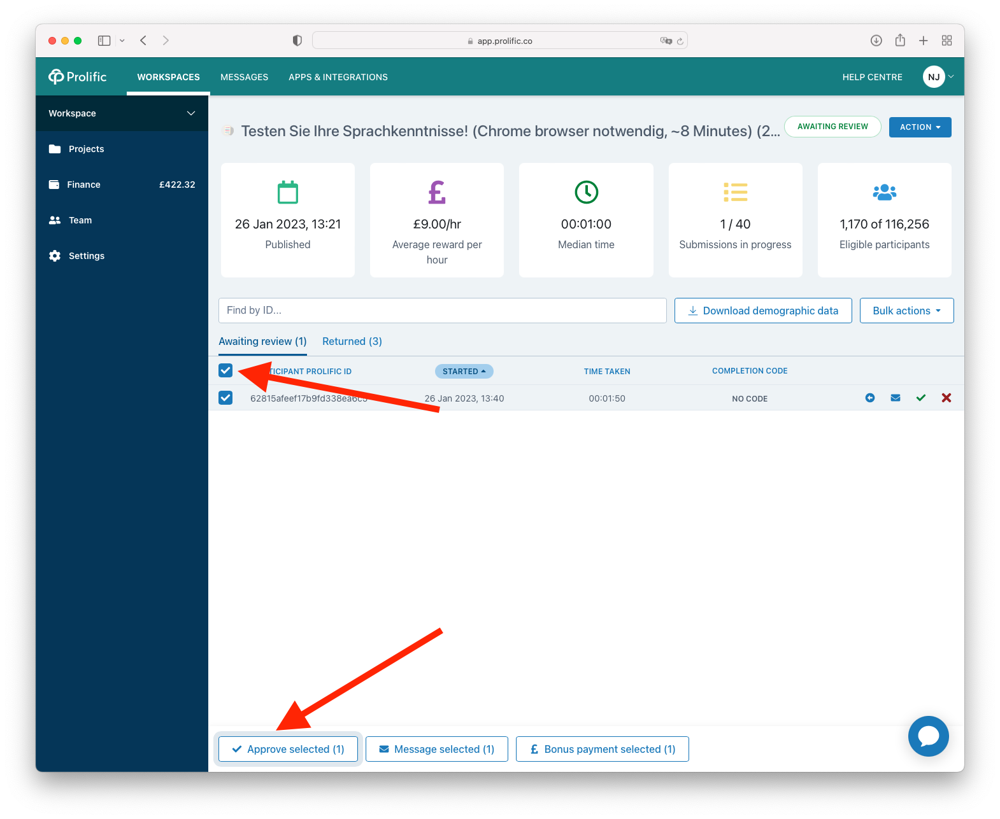
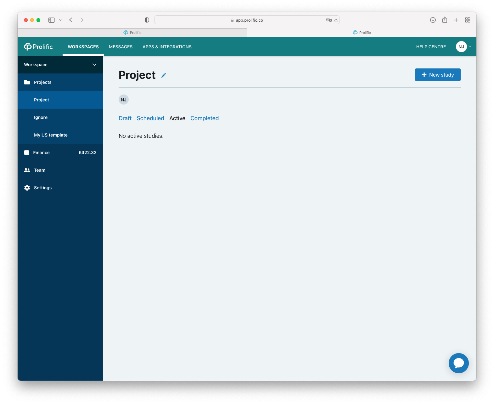

===================================
Deploying an experiment to Prolific
===================================

If you are used to deploying experiments to MTurk it can be a switch to change to Prolific. In this tutorial, we will show you how to deploy an experiment to Prolific.

Basics
------

1. Create a Prolific account, log in to it and get an API key.
2. Add the Prolific API key to your ``.dallingerconfig``:

::

    [Prolific]
    prolific_api_token = xxxxxxx

3. Update the follwing lines in your ``config.txt`` file:

- ``recruiter = prolific``
- ``title = Your experiment title (Chrome browser required, 5-10 minutes, £10/hr)`` (this is the title that will appear on Prolific). Make sure you include the words "Chrome browser required" in the title as there is no way to filter for Chrome users on Prolific. Also, make sure you include the time estimate for the experiment, so people will know how long it will take. If you need any specific hardware (e.g., headphones), make sure to include that as well.

- ``description`` description of your study which will appear on Prolific

.. warning::
    Some of our participants have been seeing a phishing warning in their Chrome browser when they navigate to our experiment.
    This error can intimidate participants. However, it disappears if you take the test in an incognito browser.
    It's a good idea to mention this in the study description so they know not to worry.

Many experiments will have a flexible duration, to mimic the MTurk behaviour of a small base payment and performance payments only for the done work, can be implemented by setting ``base_payment = 0`` in your ``config.txt``.
Set ``prolific_estimated_completion_minutes = 1`` and set
``prolific_reward_cents`` to the amount of cents you want to pay for a minute of work (Note that cents are in the currency of Prolific, see warning box). This value must reflect the ``wage_per_hour`` experiment variable.

.. warning::
    At the time of writing, Prolific sets a mandatory time out duration as a multiple of your ``prolific_estimated_completion_minutes``,
    ignoring the time out duration you may have specified in your config. If you set ``prolific_estimated_completion_minutes = 1`` you 
    might find that the time out duration is impractically small. We have recently found that 3 minutes seems to be more reasonable 
    for an experiment that actually lasts 10-15 minutes.

.. warning::
    Make sure you know in which currency Prolific pays the participant. By default they pay in British pounds. Make sure you set the ``wage_per_hour`` and ``currency`` variables accordingly. For example, if you want to pay 9 pounds per hour, set:

    ::

        class Exp(psynet.experiment.Experiment):
            …
            variables = {
                "currency": "£",
                "wage_per_hour": 9,
            }

    If you want to pay in a different currency, you need to contact Prolific support and ask them to change the currency of your account.

With these minimal settings you can sandbox to Prolific (i.e., create a draft study) via ``psynet debug heroku --app <MY-APP-NAME>`` or ``psynet debug ssh`` or deploy an experiment to Prolific via ``psynet deploy heroku --app <MY-APP-NAME>`` or ``psynet deploy ssh``.

Set qualifications
------------------
The best way to specify participants is via the Prolific interface. If you want to copy the requirements of a previous study, you can run:

::

    dallinger hits --recruiter prolific

which will return the full list of completed or running studies, e.g.:

::

    $ dallinger hits --recruiter prolific
    ❯❯ Found 23 hit[s]:
    Hit ID                    Title                                        Annotation (experiment ID)                                                                                       Status           Created                 Expiration    Description
    ------------------------  -------------------------------------------  ---------------------------------------------------------------------------------------------------------------  ---------------  ----------------------  ------------  -------------
    63cd3c0de6a9e2d84d694454  Testen Sie Ihre Sprachkenntnisse! (Chrom...  Testen Sie Ihre Sprachkenntnisse! (Chrome browser notwendig, ~8 Minutes) (2b597a65-2e1d-8255-32e4-c1036719deb8)  AWAITING REVIEW  2023/1/22 01:37:17 PM
    …

To see unpublished studies, add the ``--sandbox`` flag.

Now copy the field ``HIT ID`` and run:

::

    dallinger copy-qualifications --hit_id <HIT_ID> --recruiter prolific

Optionally, you can specify a new path for the qualification, e.g.: ``--qualification_path qualification_prolific_de.json`` for qualifications for German participants.

Finally, you need to add the qualification to your ``config.txt`` file:

::

    [Prolific]
    prolific_recruitment_config = file:prolific_config.json

If you don't have an existing experiment from which you want to copy the qualifications, you can create a draft study in Prolific and then copy its HIT ID using the same steps as before.

Extending a study
-----------------
If your study does not autorecruit more participants, you can extend the study by clicking on the "Action" button next to the study name and select "Increase places". By default this value is set to ``initial_recruitment_size``

.. image:: ../_static/images/prolific/increase_places_1.png
  :width: 800
  :alt: Increase places in the survey

Solving underpayment
--------------------
Prolific will warn you if you are paying less than you specified as an hourly rate (i.e. ``(prolific_reward_cents * (60 / prolific_estimated_completion_minutes)) / 100``).

Click on "Adjust reward per hour" and set the right hourly rate.

After adjusting the pay, you see you are paying the right amount:

Terminating a study
-------------------
First set the experiment variable ``auto_recruit`` to ``False``, you can do this by going to your Heroku app, go to "Settings", scroll down to "Config Vars", click on "Reveal Config Vars" and set ``auto_recruit = False``.

.. warning::
    Config vars in Heroku are case sensitive, so make sure you use the exact same capitalization as above.

Now go to Prolific, go to your project folder, go to the tab "Active". You can stop the survey.

If it says "Awaiting review", you can pay the remaining participants when something went wrong. To do so click on the survey and mark the participants you want to pay.

By paying the participants, your experiment automatically moves to the tab from "Active" to "Completed".

.. warning::
    If don't set ``auto_recruit`` to ``False``, but your experiment does rely on automatic recruitment the stopped survey will be reactivated automatically! So make sure autorecruitment is turned off!

You can now export your data locally and destroy your application.
